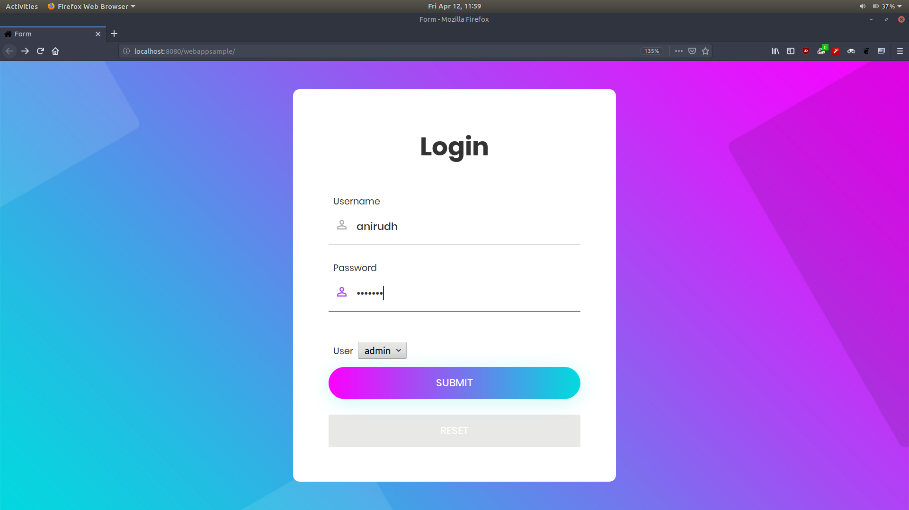
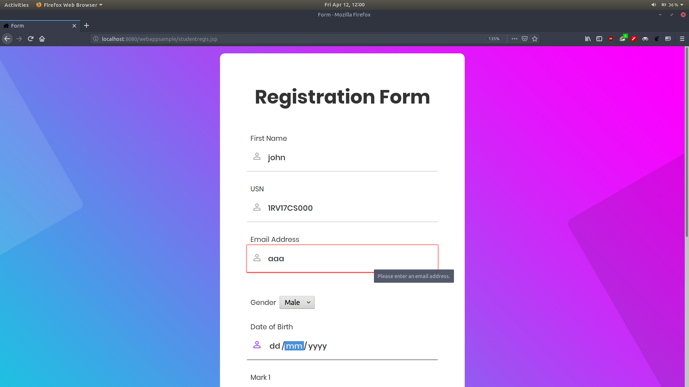
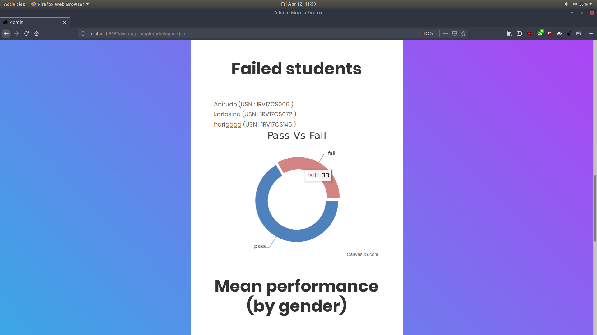

# Student Database Management System
This Student database management system is implemented using jsp and jdbc.
The application was developed in netbeans and requires mysql to be installed locally on the system. Default glassfish server is used.
This application serves two clients, an admin and a student.

The student must enter all details in the registration form which is later stored in a mysql database (called form).

Admin can perform some statistical analysis and visualisations on the information obatined from the registration form entered by the student.

        
